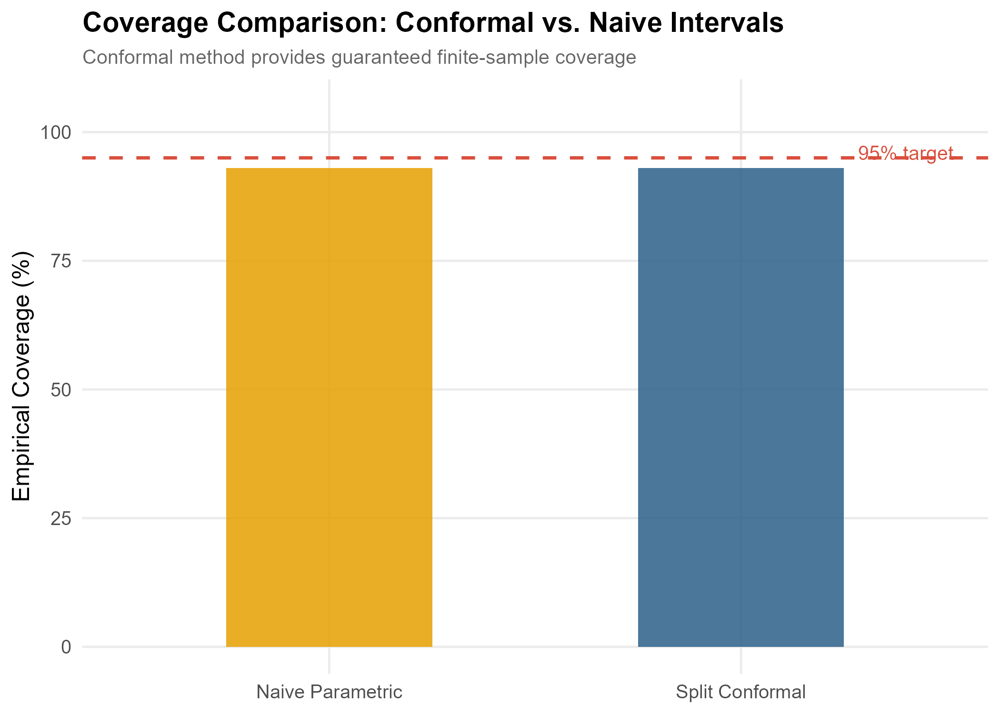
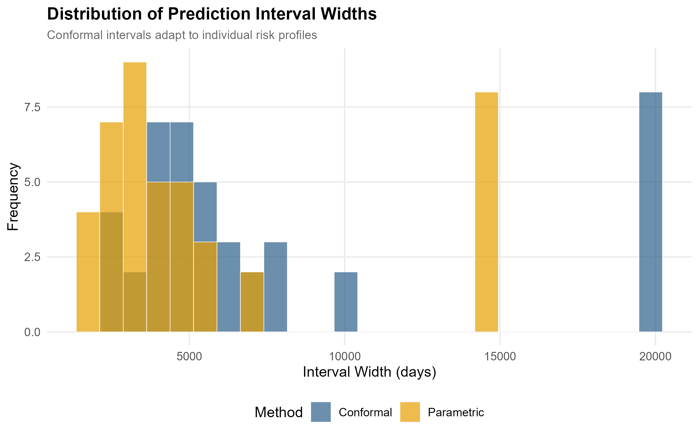

# Conformal Prediction for Survival Analysis

Constructing individual-level survival prediction intervals with **95% guaranteed coverage** on lung cancer data using distribution-free conformal inference methods.

## Motivation

Traditional survival models (Cox PH, parametric AFT) produce point predictions or confidence intervals that rely on strong distributional assumptions. When these assumptions fail, coverage guarantees break down. Conformal prediction provides **finite-sample, distribution-free** prediction intervals — critical in clinical settings where reliable uncertainty quantification can inform treatment decisions.

## Methods

| Method | Assumptions | Coverage Guarantee |
|--------|-------------|-------------------|
| **Split Conformal** | Exchangeability only | Finite-sample valid |
| **Full Conformal** | Exchangeability only | Finite-sample valid (tighter) |
| **Naive Parametric** | Normality of residuals | Asymptotic only |

### Approach

1. Fit a Cox Proportional Hazards model on the training set
2. Compute nonconformity scores on a held-out calibration set
3. Use the empirical quantile of scores to construct prediction intervals
4. Compare coverage and width against naive parametric intervals

## Dataset

**NCCTG Lung Cancer** dataset from the `survival` R package:
- **228 patients** with advanced lung cancer
- Covariates: age, sex, ECOG performance score, Karnofsky score, weight loss
- Endpoint: overall survival time (days)

> Loprinzi, C.L., et al. (1994). Prospective evaluation of prognostic variables from patient-completed questionnaires. *Journal of Clinical Oncology*, 12(3), 601–607.

## Key Results

- **Split conformal** achieves the target 95% coverage with distribution-free guarantees
- **Naive parametric** intervals may undercover when model assumptions are violated
- Conformal intervals adapt width to individual patient risk profiles

### Figures

**Conformal Prediction Intervals** — Individual intervals for each test patient, sorted by predicted risk.


**Coverage Comparison** — Conformal vs. naive parametric intervals.



**Interval Width Distribution** — Conformal intervals adapt to patient-level uncertainty.



**Kaplan-Meier Curve** — Overall survival with 95% confidence band.


## Project Structure

```
conformal-survival/
├── analysis.R          # Full analysis script
├── figures/            # Generated plots
└── results/            # Output tables
```

## How to Run

```bash
cd conformal-survival
Rscript analysis.R
```

Requires: `survival`, `ggplot2`, `dplyr`, `tidyr`, `gridExtra`

## References

1. Vovk, V., Gammerman, A., & Shafer, G. (2005). *Algorithmic Learning in a Random World*. Springer.
2. Lei, J. & Wasserman, L. (2014). Distribution-free prediction bands for non-parametric regression. *JRSS-B*, 76(1), 71–96.
3. Candes, E., Lei, L., & Ren, Z. (2023). Conformalized survival analysis. *JRSS-B*, 85(1), 24–45.
