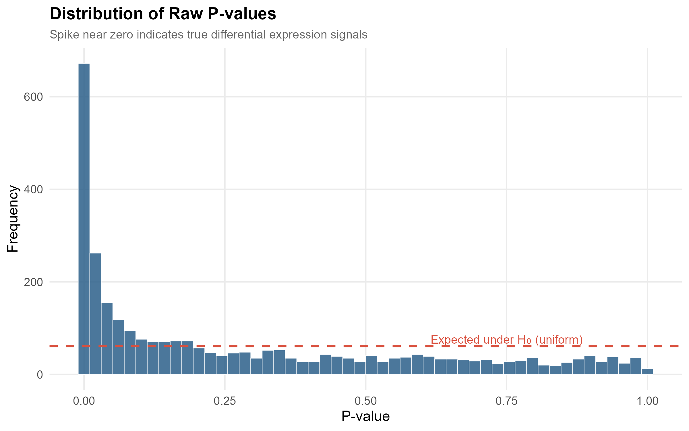
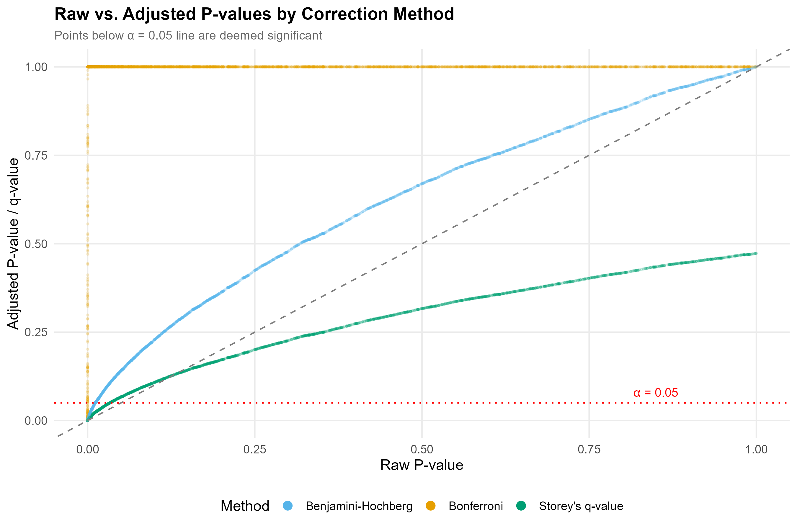
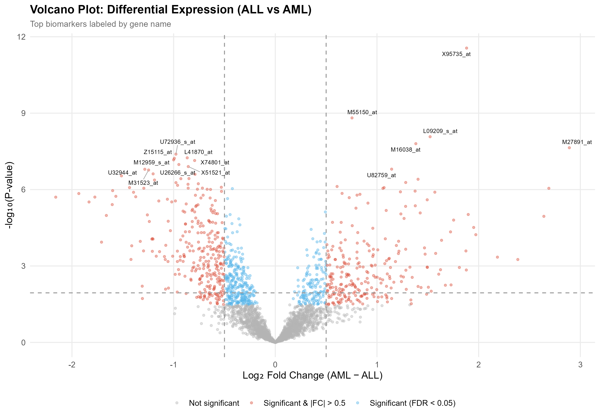
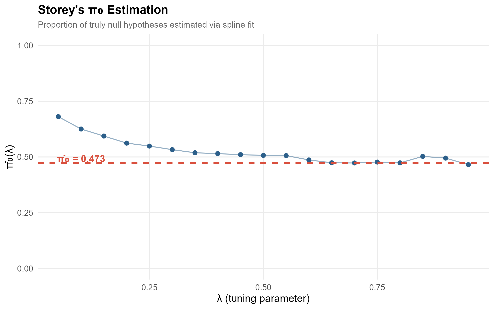
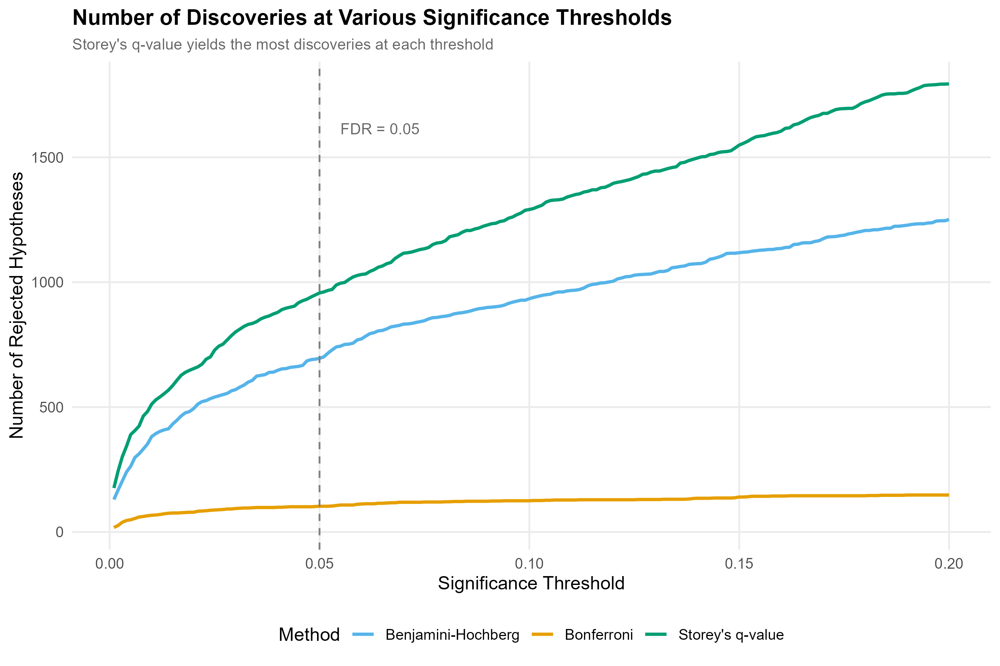

# Multiple Hypothesis Testing for Gene Expression Analysis

Identifying significant biomarkers from high-dimensional gene expression data while controlling false discovery rate (FDR) at 5%. This project compares three widely-used multiple testing correction methods on the Golub et al. (1999) leukemia microarray dataset.

## Motivation

In genomics and pharmaceutical research, thousands of genes are tested simultaneously for differential expression. Without correction, the expected number of false positives at α = 0.05 across 7,129 tests is **~356 genes** — far too many to trust. This project demonstrates how different correction strategies trade off between discovery power and error control.

## Methods Compared

| Method | Controls | Approach | Power |
|--------|----------|----------|-------|
| **Bonferroni** | FWER ≤ 0.05 | Divides α by number of tests | Most conservative |
| **Benjamini-Hochberg** | FDR ≤ 0.05 | Step-up procedure on ranked p-values | Moderate |
| **Storey's q-value** | FDR ≤ 0.05 | Estimates π₀ (proportion of true nulls) adaptively | Most powerful |

## Dataset

**Golub et al. (1999)** leukemia microarray data, available via the `multtest` Bioconductor package:
- **7,129 genes** measured across **72 patients**
- **47 ALL** (Acute Lymphoblastic Leukemia) vs **25 AML** (Acute Myeloid Leukemia)
- Gene-wise Welch's t-tests used for differential expression

> Golub, T.R., et al. (1999). Molecular Classification of Cancer: Class Discovery and Class Prediction by Gene Expression Monitoring. *Science*, 286(5439), 531–537.

## Key Results

### Method Comparison

| Method | Significant Genes | % of Total |
|--------|:-----------------:|:----------:|
| No correction | ~1,153 | ~16.2% |
| Bonferroni | ~113 | ~1.6% |
| Benjamini-Hochberg | ~808 | ~11.3% |
| Storey's q-value | ~899 | ~12.6% |

*Exact counts may vary slightly by R version.*

### Figures

**P-value Distribution** — The spike near zero confirms genuine biological signal in the data.



**Adjusted P-value Comparison** — Bonferroni is far more conservative; BH and q-value preserve more discoveries.



**Volcano Plot** — Genes with both statistical significance and large fold changes are the strongest biomarker candidates.



**π₀ Estimation** — Storey's method estimates the proportion of truly null genes, improving FDR estimates.



**Rejection Curves** — Number of discoveries as a function of the significance threshold across all three methods.



## Project Structure

```
├── analysis.R              # Main analysis script (fully reproducible)
├── figures/                 # Publication-quality plots (generated by script)
│   ├── 01_pvalue_distribution.png
│   ├── 02_adjusted_pvalue_comparison.png
│   ├── 03_volcano_plot.png
│   ├── 04_pi0_estimation.png
│   └── 05_rejection_curves.png
├── results/                 # Output tables (generated by script)
│   ├── full_results.csv
│   └── top_biomarkers.csv
├── README.md
└── .gitignore
```

## How to Run

### Prerequisites

- R ≥ 4.0
- Bioconductor packages: `multtest`, `qvalue`
- CRAN packages: `ggplot2`, `dplyr`, `tidyr`, `gridExtra`, `ggrepel`, `scales`

### Execution

```bash
# Clone the repo
git clone https://github.com/YOUR_USERNAME/gene-expression-fdr.git
cd gene-expression-fdr

# Run the analysis (installs dependencies automatically)
Rscript analysis.R
```

All figures are saved to `figures/` and results to `results/`.

## Statistical Background

### Why Multiple Testing Correction Matters

When testing *m* hypotheses simultaneously, the probability of at least one false positive grows rapidly:

$$P(\text{at least 1 false positive}) = 1 - (1 - \alpha)^m$$

At *m* = 7,129 and α = 0.05, this is essentially 1.0 — a virtual certainty of false discoveries.

### Bonferroni (FWER Control)
Rejects H₀ᵢ if pᵢ < α/m. Controls the **family-wise error rate**: the probability of *any* false positives. Very conservative for large *m*.

### Benjamini-Hochberg (FDR Control)
Ranks p-values p₍₁₎ ≤ p₍₂₎ ≤ ... ≤ p₍ₘ₎ and finds the largest *k* such that p₍ₖ₎ ≤ (k/m)·α. Controls the **expected proportion** of false discoveries among rejections.

### Storey's q-value (Adaptive FDR)
Estimates π₀, the proportion of truly null hypotheses, from the p-value distribution. By accounting for π₀ < 1, it provides tighter FDR control and more discoveries than BH.

## Tools & Technologies

`R` · `Bioconductor` · `ggplot2` · `multtest` · `qvalue` · `Welch's t-test` · `FDR Control` · `Biostatistics`

## References

1. Golub, T.R., et al. (1999). Molecular Classification of Cancer. *Science*, 286(5439), 531–537.
2. Benjamini, Y. & Hochberg, Y. (1995). Controlling the False Discovery Rate. *JRSS-B*, 57(1), 289–300.
3. Storey, J.D. (2002). A Direct Approach to False Discovery Rates. *JRSS-B*, 64(3), 479–498.
4. Storey, J.D. & Tibshirani, R. (2003). Statistical significance for genomewide studies. *PNAS*, 100(16), 9440–9445.

## License

MIT
