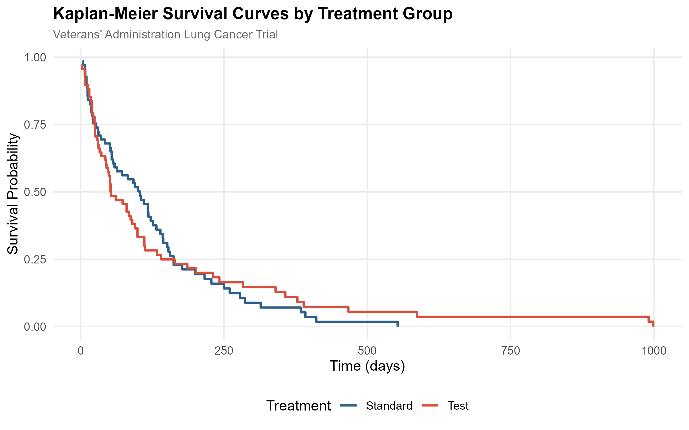
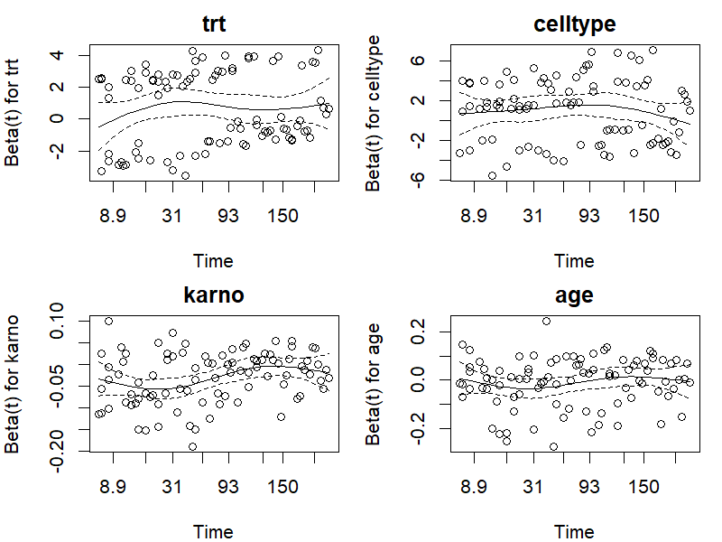

# Parametric and Semi-Parametric Survival Modeling

Comparing Weibull, Log-Normal, Log-Logistic, and Cox Proportional Hazards models for survival prediction with comprehensive model diagnostics and validation.

## Motivation

Choosing the right survival model is critical in pharmaceutical research — from clinical trial analysis to post-market surveillance. Parametric models (Weibull, Log-Normal) offer interpretable hazard functions and extrapolation capability, while semi-parametric models (Cox PH) avoid distributional assumptions. This project provides a head-to-head comparison with rigorous diagnostics to guide model selection.

## Methods

| Model | Type | Hazard Shape | Key Assumption |
|-------|------|-------------|----------------|
| **Cox PH** | Semi-parametric | Unspecified | Proportional hazards |
| **Weibull AFT** | Parametric | Monotone increasing/decreasing | Weibull-distributed survival |
| **Log-Normal AFT** | Parametric | Non-monotone (hump-shaped) | Log-normal distributed survival |
| **Log-Logistic AFT** | Parametric | Non-monotone | Log-logistic distributed survival |

### Evaluation Criteria
- **Concordance Index (C-index)**: Discrimination ability on held-out test set
- **AIC/BIC**: Goodness-of-fit penalized for complexity
- **Calibration**: Predicted vs. observed median survival
- **Schoenfeld Residuals**: Proportional hazards assumption check

## Dataset

**Veterans' Administration Lung Cancer** trial from the `survival` R package:
- **137 patients** in a randomized trial (standard vs. test chemotherapy)
- Covariates: treatment, cell type, Karnofsky performance score, age
- Endpoint: overall survival time (days)

> Kalbfleisch, J.D. & Prentice, R.L. (2002). *The Statistical Analysis of Failure Time Data*. Wiley.

## Figures

**Kaplan-Meier by Treatment** — Survival curves comparing treatment arms.



**Schoenfeld Residuals** — Diagnostics for proportional hazards assumption.



**Concordance Comparison** — Test set discrimination across all four models.


**Calibration Plot** — Predicted vs. observed median survival by risk quintile.


## Project Structure

```
survival-modeling/
├── analysis.R          # Full analysis script (R)
├── figures/            # Generated diagnostic plots
└── results/            # Model comparison tables
```

## How to Run

```bash
cd survival-modeling
Rscript analysis.R
```

Requires: `survival`, `flexsurv`, `ggplot2`, `dplyr`, `tidyr`, `gridExtra`, `survminer`

## References

1. Cox, D.R. (1972). Regression Models and Life-Tables. *JRSS-B*, 34(2), 187–220.
2. Kalbfleisch, J.D. & Prentice, R.L. (2002). *The Statistical Analysis of Failure Time Data*. Wiley.
3. Harrell, F.E. (2015). *Regression Modeling Strategies*. Springer.
